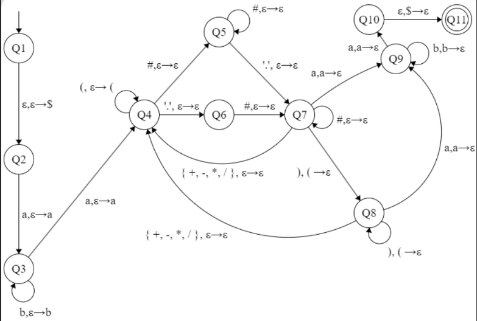

# Language Recognition with a PDA(Pushdown Automaton)

Author: [Andrew Gyakobo](https://github.com/Gyakobo)

## Introduction
The following project should define a PDA that in its turn would recognize a specific context-free language.

## Let's have a look at Language A
* A, in simple terms, is a language that defines all arithmetic floating point numbers and valid operations on said decimal or whole numbers. 

* A select string of language A is of the form: 
$$
ab^kaEab^ka, 
$$
$$
k>=0
$$

* Here is an example string: $abba(1.2*(1.-2.+3.1))abba$

> Note: Language A is not a regular language, however, it's a context-free language

### Context Free Grammar for A

Language A can be defined by a 4-tuple context-free grammar $G = (V, \Sigma, R, S)$, where:

* V = {S, T, C, H, Y, N} (set of variables, or non-terminals)

* $\Sigma$ = {., 0, 1, 2, ..., 9, +, -, *, /, (, ), a, b} (Mind you $\Sigma$ is the alphabet of all available letters, digits, and characters)

* S (start variable)

Speaking about R, the rules are as follows:

* $S \rightarrow aTa$
* $T \rightarrow bTb|aCa$
* $C \rightarrow C+C|C-C|C*C|C/C|(C)|H$
* $H \rightarrow Y.Y|Y.|.Y$ 
* $Y \rightarrow NY|N$
* $N \rightarrow 0|1|2|3|4|5|6|7|8|9$

## Let's now handle a sample example
$S \Rightarrow aTa \Rightarrow abTba \Rightarrow abbTbba \Rightarrow abba(C)abba \Rightarrow abba(C * C)abba$

$\Rightarrow abba(C* (C))abba \Rightarrow abba(C * (C-C+C))abba$

$\Rightarrow abba(H * (C-C+C))abba \Rightarrow abba(Y.Y * (C-C+C))abba \Rightarrow abba(N.N * (C-C+C))abba$

$\Rightarrow abba(1.2*(C-C+C))abba \Rightarrow abba(1.2*(H-C+C))abba \Rightarrow abba(1.2 * (Y.-C+C))abba$

$\Rightarrow abba(1.2*(N.-C+C))abba \Rightarrow abba(1.2*(1.-C+C))abba \Rightarrow abba(1.2 * (1. - H + C))abba$

$\Rightarrow abba(1.2 * (1. - Y. + C))abba \Rightarrow abba(1.2 * (1. - N. + C))abba \Rightarrow abba(1.2 * (1. - 2. + C))$

$\Rightarrow abba(1.2 * (1. - 2. + H))abba \Rightarrow abba(1.2 * (1. - 2. + Y.Y))abba \Rightarrow abba(1.2 * (1. - 2. + 3.1))abba$

### Pushdown Automaton M

Here's a simple graphic demonstration of the PDA:



#### Examples

Let's run the Pushdown Automaton M on the following string: 

```
w = abbba43.51386abbba
```

```
Enter string 1 of 15: abbba43.51386abbba
Starting on State Q1
$: Q1
Read '$'
Popped 'ε' from stack
Pushed '$' to stack
Moving to state Q2

a: Q2
Read 'a'
Popped 'ε' from stack
Pushed 'a' to stack
Moving to state Q3

b: Q3
Read 'b'
Popped 'ε' from stack
Pushed 'b' to stack
Moving to state Q3

b: Q3
Read 'b'
Popped 'ε' from stack
Pushed 'b' to stack
Moving to state Q3

b: Q3
Read 'b'
Popped 'ε' from stack
Pushed 'b' to stack
Moving to state Q3

a: Q3
Read 'a'
Popped 'ε' from stack
Pushed 'a' to stack
Moving to state Q4

4: Q4
Read '4'
Popped 'ε' from stack
Pushed 'ε' to stack
Moving to state Q5

3: Q5
Read '3'
Popped 'ε' from stack
Pushed 'ε' to stack
Moving to state Q5

.: Q5
Read '.'
Popped 'ε' from stack
Pushed 'ε' to stack
Moving to state Q7

5: Q7
Read '5'
Popped 'ε' from stack
Pushed 'ε' to stack
Moving to state Q7

1: Q7
Read '1'
Popped 'ε' from stack
Pushed 'ε' to stack
Moving to state Q7

3: Q7
Read '3'
Popped 'ε' from stack
Pushed 'ε' to stack
Moving to state Q7

8: Q7
Read '8'
Popped 'ε' from stack
Pushed 'ε' to stack
Moving to state Q7

6: Q7
Read '6'
Popped 'ε' from stack
Pushed 'ε' to stack
Moving to state Q7

a: Q7
Read 'a'
Popped 'a' from stack
Pushed 'ε' to stack
Moving to state Q9

b: Q9
Read 'b'
Popped 'b' from stack
Pushed 'ε' to stack
Moving to state Q9

b: Q9
Read 'b'
Popped 'b' from stack
Pushed 'ε' to stack
Moving to state Q9

b: Q9
Read 'b'
Popped 'b' from stack
Pushed 'ε' to stack
Moving to state Q9

a: Q9
Read 'a'
Popped 'a' from stack
Pushed 'ε' to stack
Moving to state Q10

ε: Q10
Read 'ε'
Popped '$' from stack
Pushed 'ε' to stack

String is accepted!
```